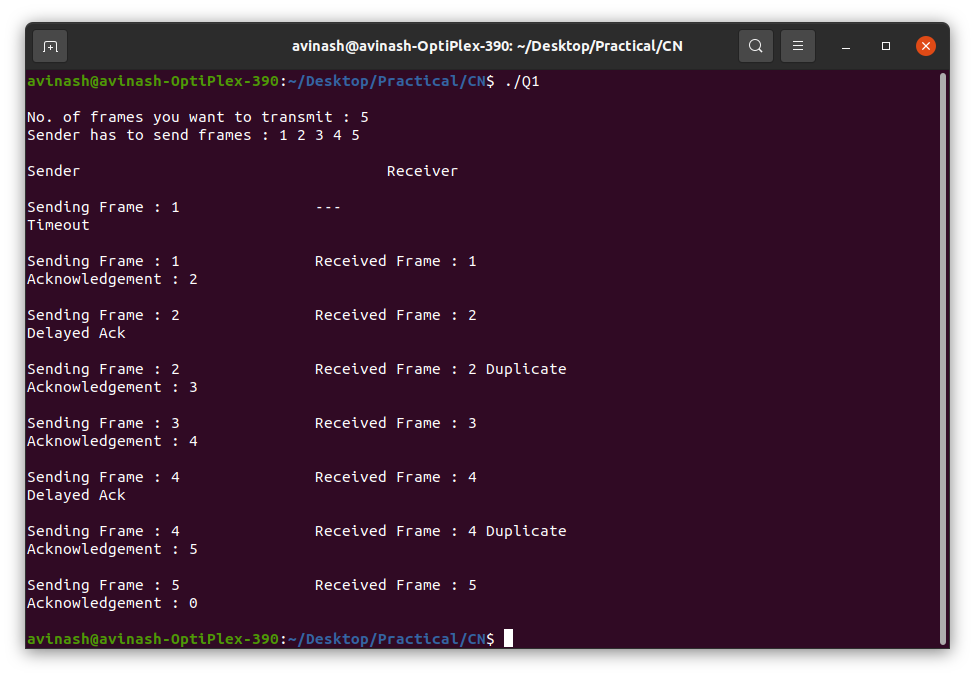
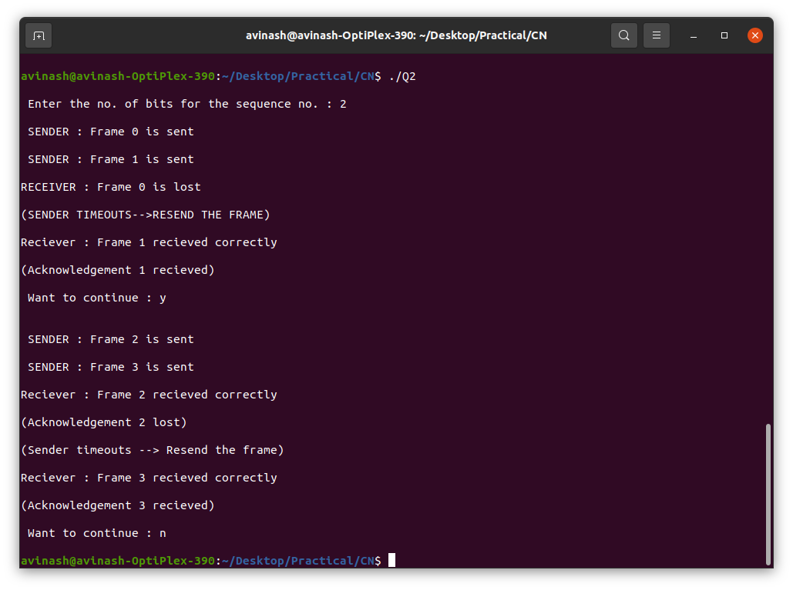

# Computer Network Practical

There are some practical code implementation regarding computer networks !!!

## Q1 Stop & wait Protocol
It is a simulator of stop & wait protocol.

#### Characteristics
* Used in Connection-oriented communication.
* It offers error and flows control
* It is used in Data Link and Transport Layers
* Stop and Wait for ARQ mainly implements the Sliding Window Protocol concept with Window Size 1

#### Output

## Q2 Selective Repeat Protocol
It is a simulator of selective repeat protocol.

#### Characteristics
* Used for error detection and control in the data link layer.
* Sender sends several frames specified by a window size even without the need to wait for individual acknowledgement from the receiver as in 
  Go-Back-N ARQ. In selective repeat protocol, the retransmitted frame is received out of sequence.
* Only the lost or error frames are retransmitted, whereas correct frames are received and buffered.
* The receiver while keeping track of sequence numbers buffers the frames in memory and sends NACK for only frames which are missing or damaged.
* The sender will send/retransmit a packet for which NACK is received.

#### Output

